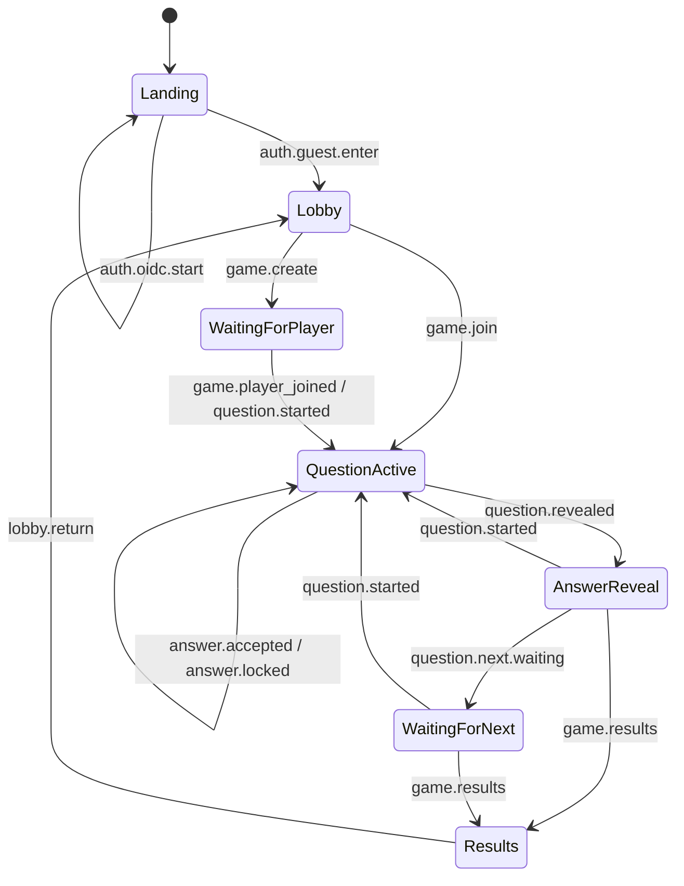

# WebSocket Protocol

This document defines the expected JSON-over-WebSocket protocol between the quiz frontend and the future backend.

The backend is authoritative for:

- lobby contents
- player roster
- game phase
- question payloads
- `questionEndsAt`
- score changes
- answer reveal timing
- next-question readiness
- final results

The frontend only sends user intents and renders server state.

## Transport Rules

- Protocol: WebSocket
- Message format: JSON object
- Encoding: UTF-8
- Time format: ISO 8601 UTC timestamps
- IDs: opaque strings generated by the backend unless otherwise noted

Each message should use this envelope:

```json
{
  "type": "game.create",
  "requestId": "req_123",
  "payload": {}
}
```

Common envelope fields:

- `type`: message name
- `requestId`: optional client-generated correlation ID for request/response pairing
- `payload`: message-specific body

Server-pushed messages do not need `requestId`, but may include it when replying to a specific request.

## Shared Data Shapes

### Lobby Game Summary

```json
{
  "id": "game_42",
  "hostName": "Mira",
  "topic": "Science",
  "questionCount": 12,
  "createdAt": "2026-04-03T09:10:00Z"
}
```

### Player Summary

```json
{
  "id": "player_1",
  "name": "Mira",
  "score": 3,
  "isReadyForNext": false
}
```

### Question

```json
{
  "id": "question_7",
  "topic": "Science",
  "prompt": "Which planet has the most moons currently known?",
  "options": [
    { "id": "a", "label": "A", "text": "Earth" },
    { "id": "b", "label": "B", "text": "Mars" },
    { "id": "c", "label": "C", "text": "Jupiter" },
    { "id": "d", "label": "D", "text": "Saturn" },
    { "id": "e", "label": "E", "text": "Neptune" }
  ]
}
```

The correct answer must not be sent until reveal time.

### Game Snapshot

```json
{
  "id": "game_42",
  "topic": "Science",
  "questionCount": 12,
  "questionIndex": 4,
  "phase": "question_active",
  "players": [
    {
      "id": "player_1",
      "name": "Mira",
      "score": 3,
      "isReadyForNext": false
    },
    {
      "id": "player_2",
      "name": "Jonah",
      "score": 2,
      "isReadyForNext": false
    }
  ]
}
```

Valid `phase` values:

- `waiting_for_player`
- `question_active`
- `answer_reveal`
- `waiting_for_next`
- `results`

## Client -> Server Messages

### `session.hello`

Sent immediately after the socket opens.

```json
{
  "type": "session.hello",
  "requestId": "req_1",
  "payload": {
    "clientVersion": "webquiz-frontend",
    "resumeToken": null
  }
}
```

Notes:

- `resumeToken` is optional for future reconnect support.
- Reconnect behavior is out of scope for v1, but the field keeps the protocol extensible.

### `auth.guest.enter`

Enter the application as a guest.

```json
{
  "type": "auth.guest.enter",
  "requestId": "req_2",
  "payload": {
    "displayName": "Mira"
  }
}
```

### `auth.oidc.start`

Start OIDC login. This is a placeholder in v1 and may return an error or redirect instruction until implemented.

```json
{
  "type": "auth.oidc.start",
  "requestId": "req_3",
  "payload": {}
}
```

### `lobby.subscribe`

Subscribe to the list of open games waiting for a second player.

```json
{
  "type": "lobby.subscribe",
  "requestId": "req_4",
  "payload": {}
}
```

### `game.create`

Create a new game and join it as player one.

```json
{
  "type": "game.create",
  "requestId": "req_5",
  "payload": {
    "topic": "Science",
    "questionCount": 12
  }
}
```

Rules:

- `questionCount` is variable and backend-validated.
- The backend should add the new game to the lobby until a second player joins.

### `game.join`

Join an existing open game as player two.

```json
{
  "type": "game.join",
  "requestId": "req_6",
  "payload": {
    "gameId": "game_42"
  }
}
```

### `answer.submit`

Submit the chosen answer for the current question.

```json
{
  "type": "answer.submit",
  "requestId": "req_7",
  "payload": {
    "gameId": "game_42",
    "questionId": "question_7",
    "answerId": "d"
  }
}
```

Rules:

- Only one submission is allowed per player per question.
- Once accepted, the answer is locked and cannot be changed.
- Submissions after timeout or after reveal must be rejected.

### `question.next.ready`

Signal that the player is ready to proceed after the reveal screen.

```json
{
  "type": "question.next.ready",
  "requestId": "req_8",
  "payload": {
    "gameId": "game_42",
    "questionId": "question_7"
  }
}
```

Rules:

- The backend advances only when both players are ready.
- If the current question is the last one, the backend should emit final results instead of another question.

### `lobby.return`

Leave the current game context and return to the lobby after results.

```json
{
  "type": "lobby.return",
  "requestId": "req_9",
  "payload": {
    "gameId": "game_42"
  }
}
```

## Server -> Client Messages

### `session.ready`

Acknowledge socket/session initialization.

```json
{
  "type": "session.ready",
  "requestId": "req_1",
  "payload": {
    "playerId": "player_1",
    "authMode": "guest"
  }
}
```

### `auth.oidc.pending`

Indicates that OIDC exists conceptually but is not yet active in v1.

```json
{
  "type": "auth.oidc.pending",
  "requestId": "req_3",
  "payload": {
    "message": "OIDC is not enabled yet."
  }
}
```

### `lobby.snapshot`

Full snapshot of open games.

```json
{
  "type": "lobby.snapshot",
  "payload": {
    "games": [
      {
        "id": "game_42",
        "hostName": "Mira",
        "topic": "Science",
        "questionCount": 12,
        "createdAt": "2026-04-03T09:10:00Z"
      }
    ]
  }
}
```

This may be emitted:

- after `lobby.subscribe`
- after `game.create`
- when another client creates or joins a game

### `game.created`

Confirms game creation and returns the initial waiting-room snapshot.

```json
{
  "type": "game.created",
  "requestId": "req_5",
  "payload": {
    "game": {
      "id": "game_42",
      "topic": "Science",
      "questionCount": 12,
      "questionIndex": 0,
      "phase": "waiting_for_player",
      "players": [
        {
          "id": "player_1",
          "name": "Mira",
          "score": 0,
          "isReadyForNext": false
        }
      ]
    }
  }
}
```

### `game.joined`

Confirms that the current client joined an open game.

```json
{
  "type": "game.joined",
  "requestId": "req_6",
  "payload": {
    "game": {
      "id": "game_42",
      "topic": "Science",
      "questionCount": 12,
      "questionIndex": 0,
      "phase": "question_active",
      "players": [
        {
          "id": "player_1",
          "name": "Mira",
          "score": 0,
          "isReadyForNext": false
        },
        {
          "id": "player_2",
          "name": "Jonah",
          "score": 0,
          "isReadyForNext": false
        }
      ]
    }
  }
}
```

### `game.player_joined`

Broadcast to both players when the second player joins a waiting game.

```json
{
  "type": "game.player_joined",
  "payload": {
    "gameId": "game_42",
    "player": {
      "id": "player_2",
      "name": "Jonah"
    }
  }
}
```

### `question.started`

Starts a new question round.

```json
{
  "type": "question.started",
  "payload": {
    "gameId": "game_42",
    "questionIndex": 0,
    "questionCount": 12,
    "questionEndsAt": "2026-04-03T09:12:30Z",
    "question": {
      "id": "question_7",
      "topic": "Science",
      "prompt": "Which planet has the most moons currently known?",
      "options": [
        { "id": "a", "label": "A", "text": "Earth" },
        { "id": "b", "label": "B", "text": "Mars" },
        { "id": "c", "label": "C", "text": "Jupiter" },
        { "id": "d", "label": "D", "text": "Saturn" },
        { "id": "e", "label": "E", "text": "Neptune" }
      ]
    },
    "players": [
      {
        "id": "player_1",
        "name": "Mira",
        "score": 0,
        "isReadyForNext": false
      },
      {
        "id": "player_2",
        "name": "Jonah",
        "score": 0,
        "isReadyForNext": false
      }
    ]
  }
}
```

Rules:

- This must be sent when both players are present.
- The frontend should derive its countdown from `questionEndsAt`, not from a local 30-second timer started independently.

### `answer.accepted`

Acknowledges a player's answer was received and locked.

```json
{
  "type": "answer.accepted",
  "requestId": "req_7",
  "payload": {
    "gameId": "game_42",
    "questionId": "question_7",
    "playerId": "player_2",
    "locked": true
  }
}
```

### `answer.locked`

Broadcast when any player's answer becomes locked.

```json
{
  "type": "answer.locked",
  "payload": {
    "gameId": "game_42",
    "questionId": "question_7",
    "playerId": "player_1"
  }
}
```

Notes:

- This message intentionally does not reveal the answer choice.
- It only tells the other client that the player is done answering.

### `question.revealed`

Reveals the correct answer and updated scores after both players have answered or time runs out.

```json
{
  "type": "question.revealed",
  "payload": {
    "gameId": "game_42",
    "questionId": "question_7",
    "correctAnswerId": "d",
    "players": [
      {
        "id": "player_1",
        "name": "Mira",
        "score": 1,
        "isReadyForNext": false,
        "didAnswerCorrectly": true
      },
      {
        "id": "player_2",
        "name": "Jonah",
        "score": 0,
        "isReadyForNext": false,
        "didAnswerCorrectly": false
      }
    ],
    "reason": "both_answered"
  }
}
```

Valid `reason` values:

- `both_answered`
- `time_expired`

Rules:

- If a player did not answer before timeout, the backend should treat that as `no answer`.
- The reveal must still include correctness booleans for both players.
- The frontend shows whether the opponent was correct, not which option the opponent selected.

### `question.next.waiting`

Broadcast when one player has clicked next but the other has not.

```json
{
  "type": "question.next.waiting",
  "payload": {
    "gameId": "game_42",
    "questionId": "question_7",
    "players": [
      {
        "id": "player_1",
        "name": "Mira",
        "score": 1,
        "isReadyForNext": true
      },
      {
        "id": "player_2",
        "name": "Jonah",
        "score": 0,
        "isReadyForNext": false
      }
    ]
  }
}
```

### `game.results`

Final game result after the last question.

```json
{
  "type": "game.results",
  "payload": {
    "gameId": "game_42",
    "players": [
      {
        "id": "player_1",
        "name": "Mira",
        "score": 7,
        "isReadyForNext": false
      },
      {
        "id": "player_2",
        "name": "Jonah",
        "score": 5,
        "isReadyForNext": false
      }
    ],
    "winnerPlayerId": "player_1",
    "winnerLabel": "Mira wins"
  }
}
```

If the game is tied:

```json
{
  "type": "game.results",
  "payload": {
    "gameId": "game_42",
    "players": [
      {
        "id": "player_1",
        "name": "Mira",
        "score": 6,
        "isReadyForNext": false
      },
      {
        "id": "player_2",
        "name": "Jonah",
        "score": 6,
        "isReadyForNext": false
      }
    ],
    "winnerPlayerId": null,
    "winnerLabel": "Draw game"
  }
}
```

### `error`

Generic request failure or invalid-state message.

```json
{
  "type": "error",
  "requestId": "req_6",
  "payload": {
    "code": "GAME_FULL",
    "message": "That game already has two players."
  }
}
```

Suggested error codes:

- `INVALID_NAME`
- `LOBBY_NOT_SUBSCRIBED`
- `GAME_NOT_FOUND`
- `GAME_FULL`
- `INVALID_QUESTION_COUNT`
- `INVALID_GAME_PHASE`
- `ANSWER_ALREADY_LOCKED`
- `QUESTION_TIMEOUT`
- `NOT_A_GAME_MEMBER`
- `OIDC_NOT_ENABLED`

## State Machine

### Application State

```text
landing
  -> auth.guest.enter -> lobby
  -> auth.oidc.start -> landing

lobby
  -> game.create -> waiting_for_player
  -> game.join -> question_active

results
  -> lobby.return -> lobby
```

### Per-Game State

```text
waiting_for_player
  -> game.player_joined -> question_active

question_active
  -> answer.accepted / answer.locked
  -> question.revealed when both players answered
  -> question.revealed when questionEndsAt passes

answer_reveal
  -> question.next.ready from one player -> waiting_for_next
  -> question.next.ready from both players -> question_active or results

waiting_for_next
  -> question.started for next question
  -> game.results after final question

results
  -> lobby.return -> lobby
```

### Mermaid Diagram



## Ordering and Timing Guarantees

- The backend must never send `question.revealed` before sending `question.started` for the same question.
- The backend must not accept multiple answers from the same player for the same question.
- The backend must ignore or reject `question.next.ready` before the reveal phase.
- `question.revealed` must reflect the final authoritative scores for that round.
- `game.results` must be sent exactly once per completed game.

## Minimal Happy-Path Sequence

1. Client connects and sends `session.hello`
2. Client sends `auth.guest.enter`
3. Client sends `lobby.subscribe`
4. Server sends `lobby.snapshot`
5. Client sends `game.create` or `game.join`
6. Server sends `game.created` or `game.joined`
7. Server sends `game.player_joined` if needed
8. Server sends `question.started`
9. Each client sends `answer.submit`
10. Server sends `answer.accepted` and `answer.locked`
11. Server sends `question.revealed`
12. Each client sends `question.next.ready`
13. Server sends `question.started` for the next round, or `game.results` after the last one
14. Client sends `lobby.return`

## Versioning

The backend should reserve a place for protocol version negotiation. A simple v1 extension is:

```json
{
  "type": "session.hello",
  "payload": {
    "protocolVersion": 1,
    "clientVersion": "webquiz-frontend",
    "resumeToken": null
  }
}
```

If the versions are incompatible, the backend should answer with:

```json
{
  "type": "error",
  "payload": {
    "code": "UNSUPPORTED_PROTOCOL_VERSION",
    "message": "Client protocol version is not supported."
  }
}
```
